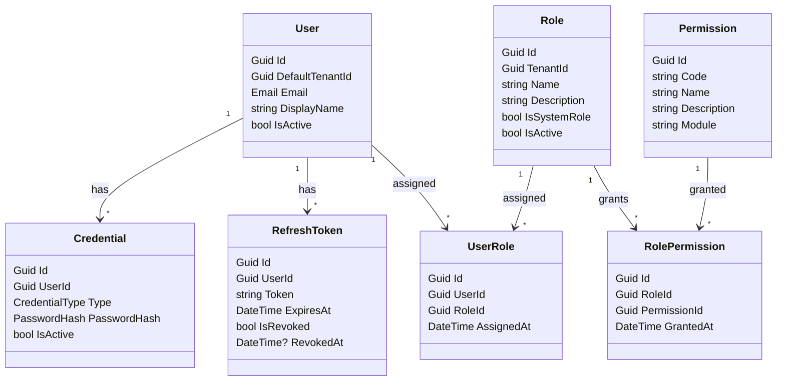

# Identity Module

Authentication and authorization: users, roles, permissions, and credentials.

## Overview

The Identity module owns the domain model for:

- Users (can span multiple tenants; `DefaultTenantId` picks the primary tenant context)
- Credentials (password now; external providers / MFA later)
- Roles and permissions
- Refresh tokens

This first iteration focuses on an enterprise-ready **domain foundation** (Result pattern, domain events, guard-style validation, future roadmap notes), while keeping the implementation intentionally minimal.

## Purpose

- Manage identity entities (users, roles, permissions) within a tenant.
- Support login, token issuance, and identity verification.
- Provide contracts for other modules that depend on identity.

## Projects

- **Identity.Module** – host integration, references Tenant.Contracts
- **Identity.Domain** – domain entities and logic
- **Identity.Application** – use cases and application services
- **Identity.Infrastructure** – persistence and external integrations
- **Identity.Contracts** – shared DTOs and API contracts
- **Identity.Migrations** – FluentMigrator migrations for this module

## Migration dependencies

Depends on **Tenant**. Run Tenant migrations before Identity.

## Database Schema

**Schema**: `identity`

### Tables (match Domain Model)

- **users** – User aggregate root
- **roles** – Role entity
- **permissions** – Permission entity
- **user_roles** – Many-to-many junction
- **role_permissions** – Many-to-many junction

### Default Roles

- **Admin** – Full system access (all permissions)
- **User** – Basic user access (read-only permissions)

### Default Permissions

- `users.read`, `users.create`, `users.update`, `users.delete`
- `roles.read`, `roles.create`, `roles.update`, `roles.delete`
- `permissions.read`, `permissions.assign`

### Development Users (Development profile only)

- **admin@dev.local** / Admin123! (Admin role)
- **user@dev.local** / User123! (User role)

## Running Migrations

### Production (no dev users)

```bash
dotnet run --project server/src/MigrationRunner -- --environment Production
```

### Development (with dev users)

When the runner supports `--profile Development`:

```bash
dotnet run --project server/src/MigrationRunner -- --environment Development --profile Development
```

## Migration Version Table

FluentMigrator automatically creates `identity.__FluentMigrator_VersionInfo` to track applied migrations.

```sql
SELECT * FROM identity.__FluentMigrator_VersionInfo ORDER BY version;
```

## Domain Model



## Current Features

- **Domain model**: entities, value objects, domain events, repository interfaces, domain service interfaces.
- **No infrastructure yet**: persistence, hashing implementation, and API use-cases are planned for later phases.

## Feature Roadmap

- **Phase 1**: Basic domain CRUD foundation (current)
- **Phase 2**: Security hardening (email confirmation, account locking, password policies)
- **Phase 3**: Advanced features (MFA, external auth, sessions, GDPR)
- **Phase 4**: Enterprise scale (password expiration, data retention, anonymization)

## Extension Points

- Add real password hashing in `Identity.Infrastructure` (implements `Identity.Domain.Services.IPasswordHasher`)
- Add persistence and repository implementations in `Identity.Infrastructure`
- Add commands/queries/validators in `Identity.Application`

## Dependencies

- `BuildingBlocks.Kernel` (domain + Result primitives)
